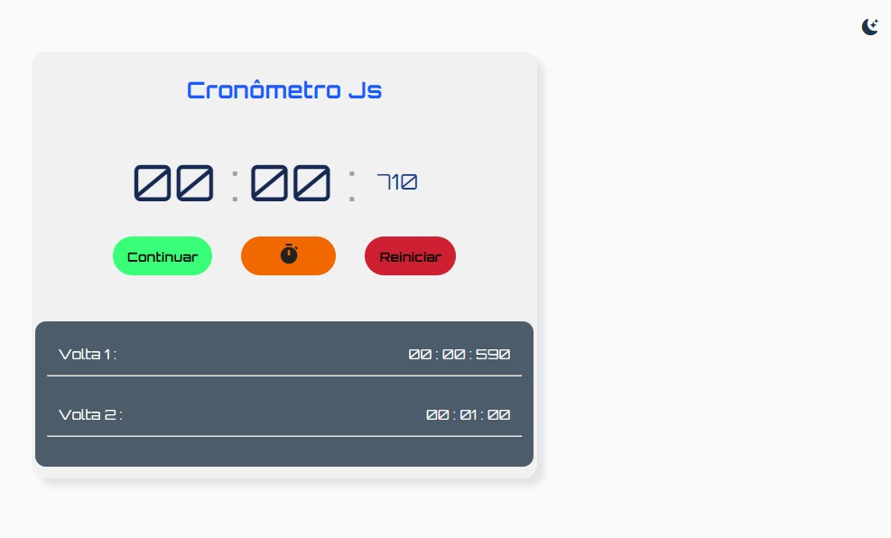
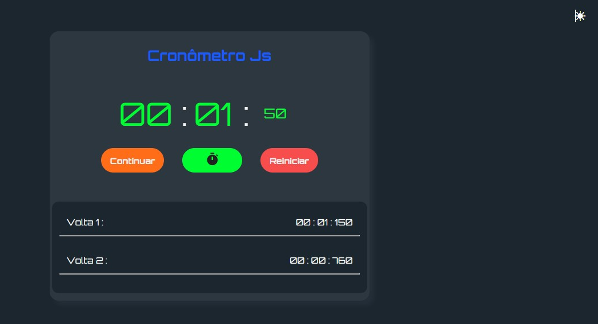
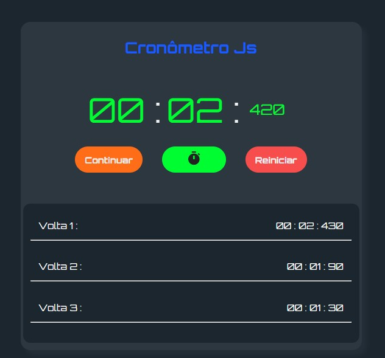

# Landing page para Eletricista

##  📋 Índice

- <a href="#sobre-o-projeto">Sobre o Projeto</a>
- <a href="#objetivos">Objetivos</a>
- <a href="#funcionalidades">Funcionalidades</a>
- <a href="#captura-de-tela">Capitura de Tela</a>
- <a href="#linguagens-utilizadas">Linguagens utilizadas</a>
- <a href="#o-que-eu-aprendi">O que eu aprendi</a>
- <a href="#recursos-úteis">Recursos úteis</a>
- <a href="#autor">Autor</a>

##  Sobre o Projeto

Nesse Projeto fiz uma implementação no Cronômetro do Hora de Codar, nele eu fiz um botão para resitrar o tempo em que um corredor ou uma carro de corrida faz uma volta, ao clicar no botão ele cria uma lista dinâmica com onumero da volta e o tempo que essa volta teve, também implementei o dark mode no projeto.

##  Objetivos

- Ganhar mais conhecimento em JavaScript
- Trabalhar o raciocinio lógico.

## Funcionalidades

1. Botão para iniciar o cronômetro.
2. Botão para pausar o cronômetro.
3. Botão para continuar o cronômetro.
4. Botão para reiniciar o cronômetro.
5. Botão para registrar o tempo(Icone cronômetro).
6. Registrar o tempo de cada volta.
7. Dark Theme.

## Captura de tela 
📸

## Demonstração

[Link Demontração](https://cronometro-digital-2023.netlify.app/)

## Linguagens utilizadas
📝
HTML | CSS | JavaScript

###  O que eu aprendi
🤓

- Criar Layout de um Cronômetro.
- trabalhar com setInterval, template string para inserir a lista de voltar na tela

### Desenvolvimento contínuo

- Quero continuar aprendendo sobre template strings
- Quero continuar aprendendo sobre manipulação de DOM
- Quero continuar aprendendo sobre manipulação de eventos
- Quero continuar aprendendo sobre manipulação de datas
- Quero continuar aprendendo sobre manipulação de arrays
- Quero continuar aprendendo sobre manipulação de objetos
- Quero continuar aprendendo sobre manipulação de funções

## Melhorias na alicação

1 - Registrar a lista do de voltas somente quando o botão iniciar tiver sido clicado, nesse momento está iniciando qundo clico no botão tempo(icone cronômetro).

2 - Implementar a deferença entre cada volta e mostrar na lista.

3 - Responsividade do cronômetro.

## Lista de possíveis implementações

- [] Implementar a responsividade.

###   Recursos Úteis
🔧
- <a href="https://icons.getbootstrap.com/">Bootstrap Icons</a>

###   Créditos

- Matheus Battisti - Hora de Codar Peguei o cronômetro no canal do <a href="https://www.youtube.com/watch?v=SbST27OWpmo&t=13s">Youtube</a>  e inplementei a captura das voltas. 

##   Autor
🧑‍💻

### Vanderlei Junior
- <a href="https://github.com/VanderleiGeronimoJunior">GitHub</a>
- <a href="https://www.linkedin.com/in/vanderlei-junior-b9956686/">Linkedin</a>

